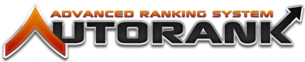

# What is Autorank?

Autorank is an automatic ranking plugin that allows you to set paths that have requirements. You can create requirements that make certain a player has at least x amount of money or x minutes played.

**An example:**

A player starts out as Guest. When he has played for more than 10 minutes and broke at least 10 iron ore, he will be ranked up to Member where he can do a lot of other things. Then, when he has played for a couple of days and earned a 1000 money, he will be promoted to Trusted; a group that allows him to do cool stuff. This can go on for as many ranks as you like. The possibilities are endless! It's up to you!

## How does Autorank work?

To work with Autorank, you'll need to learn how to configure it. Internally, it works with 'paths'. Paths are a group of requirements that players need to complete. Once a path is completed, the player can be rewarded anything!

Go to the next page to read more about how to configure Autorank!

