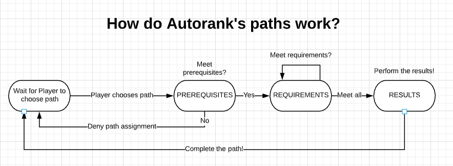

# Understanding the Paths system

## The Basics

As you probably know, Autorank works with paths. A path is a group of requirements that the player needs to complete \(in any order\). A player can only complete the _requirements_ of a path whenever the path is active for that player. To activate a path for a player, the player must be eligible for the path. To be eligible for a path, the player needs to meet all the _prerequisites_ of the path.

Once a player has activated \(or joined\) a path, he'll need to meet all the requirements to complete it. A player may have multiple active paths at the same time. Here's a figure to understand the flow of the Paths system:

#### What about an example?

It's always nice to think of examples of some theory, so let's try that: think of a server where the admins want to reward a player for participating in a marathon. We could make a path that rewards players based on the number of blocks they have walked! However, we only want to reward players if they are in a group called '_Participants_' \(think of this like registering for a marathon\). This path can easily be modelled by Autorank. 

You create a path, let's say '_Run a marathon'_  that has one prerequisite: a player must be in the _Participants_ rank. Next, we add a requirement: a player has to walk for a total of 42 kilometers \(about the length of a marathon\). Lastly, we add a result: they will be rewarded with some money!

#### **Give me another example!**

Let's say you are building a server where people are born \(a.k.a. spawned\) in a profession. They then have to traverse down their career ladder to get to the highest rank that is available in their profession tree. You can have paths based on what group you are in. You can have Bakers that need to bake 50 loaves of bread before they can rank up, or Miners that need to mine 100 gold, or Builders that need to place at least 500 blocks. The sky is the limit! 

**Okay, a final example...**

Autorank can also check what achievements a player already obtained. You could use this to create a server where players are rewarded on the number of achievements they have completed. Players could start hunting achievements to get extra rewards for their efforts!

#### Summarizing...

To summarize, Autorank can facilitate many ways of setting up ranks. To summarize, Autorank works with Paths. Each path consists of _**prerequisites**_ \(conditions to be eligible to activate a path\), _**requirements**_ \(tasks that need to be performed to complete the path\) and _**results**_ \(actions that are performed when the player completes a path\). Players can have many active paths at the same time.

